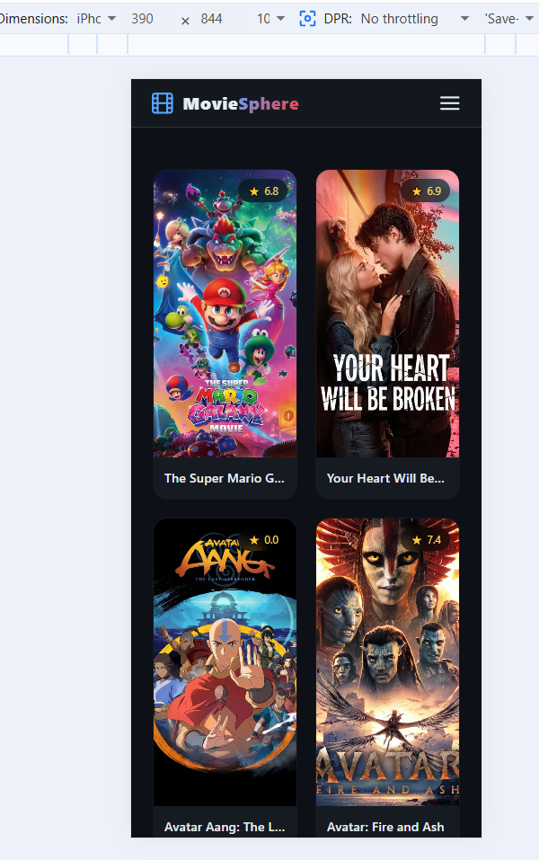
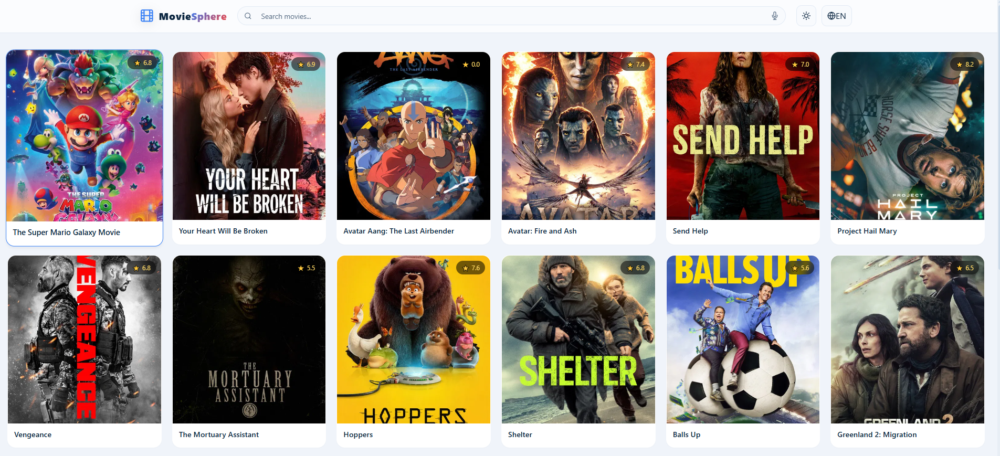
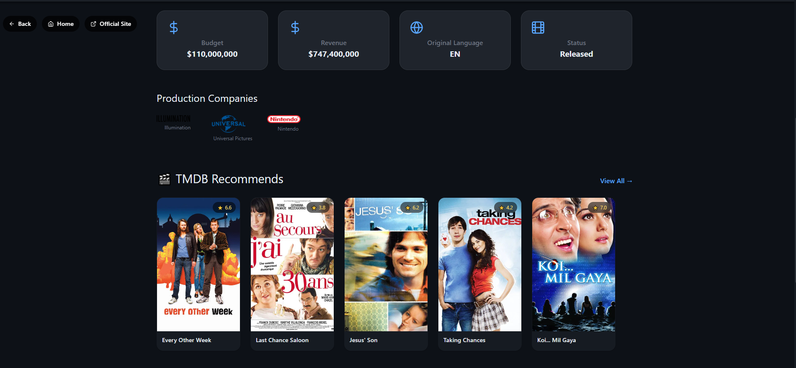
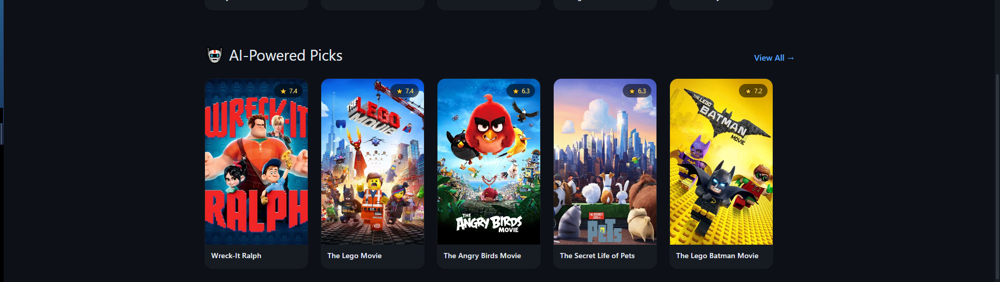
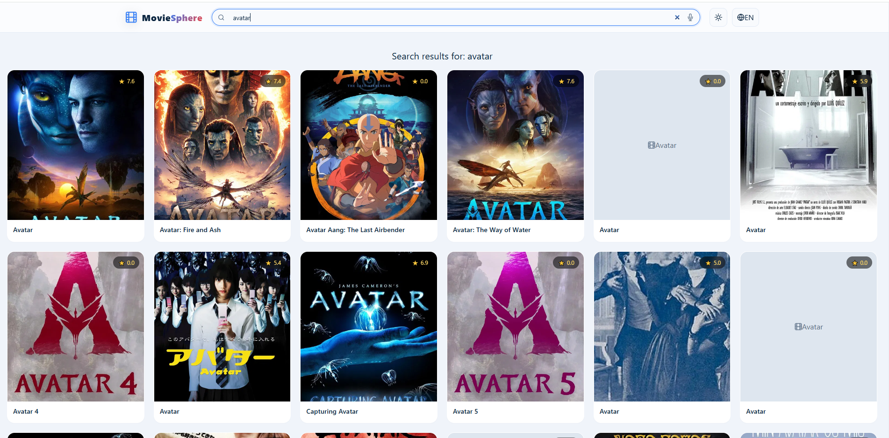
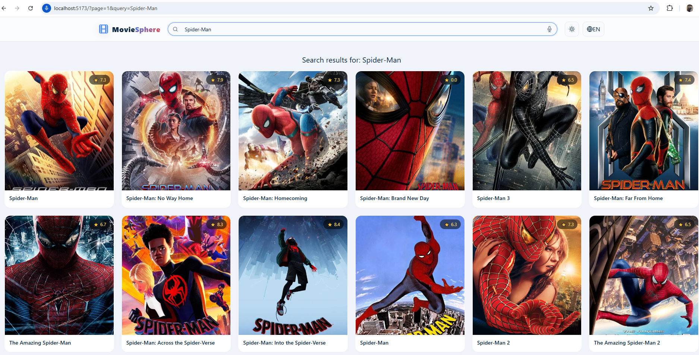
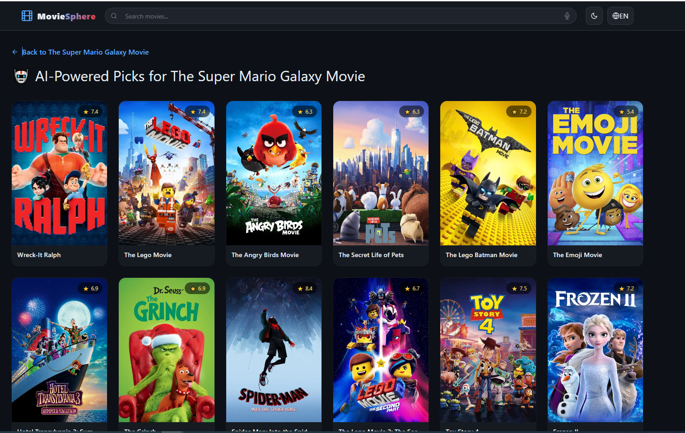
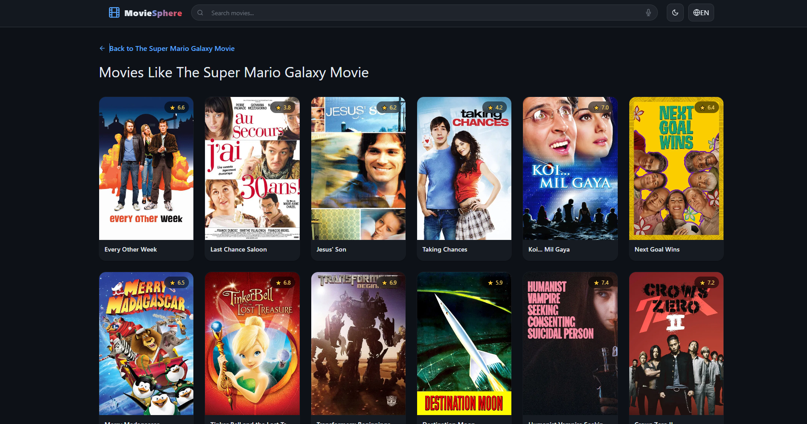

# 🎬 MovieSphere

**MovieSphere** is a modern, full‑stack movie discovery platform.  
It combines data from **TMDB** with a **generative AI** (Groq) to deliver personalised movie recommendations.  
The project is actively evolving – current features include movie browsing, search, details, AI recommendations, voice search, dark/light mode, and basic i18n (English/Arabic).

🔗 **Live Demo:** *(coming soon)*

---

## ✨ Current Features

- 🔍 **Search & Pagination** – Find movies by title, browse through results.
- 🎭 **Movie Details** – View overview, budget, revenue, production companies, etc.
- 🤖 **AI‑Powered Recommendations** – Using Groq’s free LLM (`llama-3.1-8b-instant`) to suggest similar movies based on title, year, genres, and plot.
- 🎬 **TMDB Similar Movies** – Classic collaborative filtering recommendations.
- 🎙️ **Voice Search** – Speak your query (Web Speech API).
- 🌙 **Dark / Light Mode** – System preference + manual toggle.
- 🌍 **Internationalization (i18n)** – English & Arabic, with RTL layout for Arabic.
- 📱 **Responsive Design** – Works on desktop, tablet, and mobile.
- ⚡ **Basic Performance Optimisations** – Lazy loading images, React.memo on MovieCard.

---

## 📸 Screenshots

All screenshots are stored in the `screenshots/` folder.

---

### 📱 Mobile Views

<p align="center">
  
  
</p>

---

### 🌙 Dark Mode & RTL

<p align="center">
  
  
</p>

---

### ☀️ Light Mode

<p align="center">
  
  
</p>

---

### 🎞️ Movie Details

<p align="center">
  
  
  
</p>

---

### 🔍 Search & Features

<p align="center">
  
  
  
</p>

---

### 🤖 AI & Recommendations

<p align="center">
  
  
</p>
---


## 🛠️ Tech Stack (Current)

### Frontend
- React 18 + TypeScript 
- Redux Toolkit 
- React Router DOM
- Vite 
- Tailwind CSS + SCSS 
- Framer Motion 
- i18next

### Backend (AI endpoint)
- Node.js + Express
- Groq API (free tier)

### Testing (partial – to be expanded)
- Jest (setup ready)

---

## 🚧 Planned / Future Work

This project is **ongoing**. The following enhancements are in the roadmap:

| Area | Planned Features |
|------|------------------|
| **Performance** | Code splitting (route‑based), SWR/React Query caching, virtual scrolling, bundle analysis, preconnect hints, font optimisation. |
| **Testing** | Full Jest + React Testing Library suite (unit, integration, coverage >80%). E2E tests with Playwright. Accessibility tests. |
| **Mobile** | React Native app (iOS & Android) sharing Redux, API client, and types via a `shared/` folder. Features: bottom tabs, push notifications, offline support, share sheet, haptics. |
| **AI Enhancements** | • **Q&A system** – Ask natural language questions (“What are the best action movies from 2020?”) and get AI‑generated answers + movie lists.<br>• **Mood‑based search** – “Find a relaxing movie for tonight.”<br>• **Explain recommendations** – AI explains why a movie was suggested.<br>• **Sentiment‑based recommendations** – Using review analysis from TMDB. |
| **Advanced Sorting & Filtering** | Sort by rating, release date, popularity, budget, revenue. Filter by genre, year range, language, vote count. |
| **User Features** | Authentication (JWT), personal watchlist, favourites, ratings, watched history. |
| **Deployment** | Docker containerisation, Google Cloud Run (serverless), GitHub Actions CI/CD. |

---

## 🚀 Getting Started (Local Development)

### Prerequisites
- Node.js (v18+)
- npm or yarn
- [TMDB API key](https://www.themoviedb.org/signup)
- [Groq API key](https://console.groq.com) (free, no credit card required)

### 1. Clone the repository
```bash
git clone https://github.com/YoussefAdel170/moviesphere.git
cd moviesphere
```

### 2. Backend (AI Recommendations)
```bash
cd moviesphere-backend
npm install
cp .env.example .env   # add your GROQ_API_KEY
npm start
```

### 3. Frontend
```bash
cd moviesphere-frontend
npm install
cp .env.example .env   # add VITE_API_KEY (TMDB key)
npm run dev
```
> **Notes:**  
        > Frontend runs on **http://localhost:5173**
        > The Vite proxy forwards /api requests to the backend, so no CORS issues.


---

## 📁 Project Structure

```text
moviesphere/
├── moviesphere-backend/
│   ├── routes/
│   │   └── ai-groq.js
│   ├── server.js
│   ├── .env.example
│   └── package.json
├── moviesphere-frontend/
│   ├── src/
│   │   ├── assets/   
│   │   ├── components/ui/    
│   │   ├── hooks/
│   │   ├── i18n.js
│   │       ├── locales/
│   │           ├── en-US/ 
│   │           ├── ar/
│   │   ├── pages/
│   │   ├── redux/features
│   │   ├── services/
│   │   ├── utils/
│   │   └── App.tsx
│   ├── index.html
│   ├── vite.config.js
│   └── package.json
├── shared/ (planned for React Native)
├── docker-compose.yml (planned)
├── README.md
```