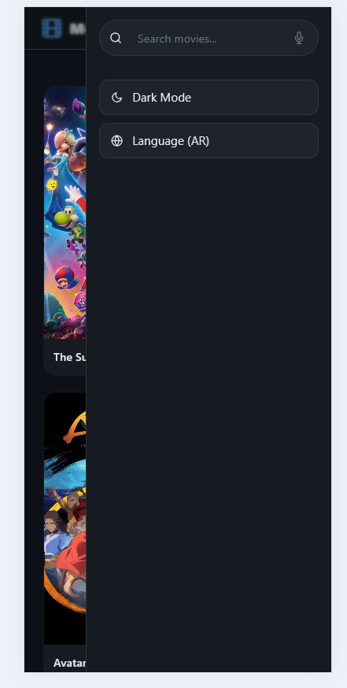
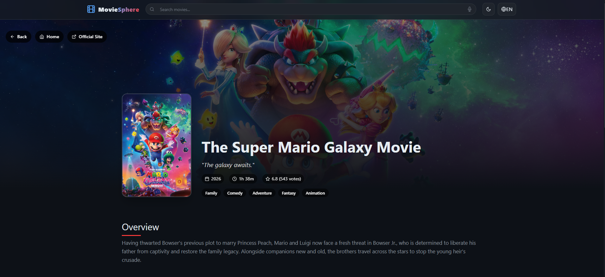

# 🎬 MovieSphere

**MovieSphere** is a modern, full‑stack movie discovery platform.  
It combines data from **TMDB** with a **generative AI** (Groq) to deliver personalised movie recommendations.  
The project is actively evolving – current features include movie browsing, search, details, AI recommendations, voice search, dark/light mode, and basic i18n (English/Arabic).

🔗 **Live Demo:** *(coming soon)*

---

## ✨ Current Features

- 🔍 **Search & Pagination** – Find movies by title, browse through results.
- 🎭 **Movie Details** – View overview, budget, revenue, production companies, etc.
- 🤖 **AI‑Powered Recommendations** – Using Groq’s free LLM (`llama-3.1-8b-instant`) to suggest similar movies based on title, year, genres, and plot.
- 🎬 **TMDB Similar Movies** – Classic collaborative filtering recommendations.
- 🎙️ **Voice Search** – Speak your query (Web Speech API).
- 🌙 **Dark / Light Mode** – System preference + manual toggle.
- 🌍 **Internationalization (i18n)** – English & Arabic, with RTL layout for Arabic.
- 📱 **Responsive Design** – Works on desktop, tablet, and mobile.
- ⚡ **Basic Performance Optimisations** – Lazy loading images, React.memo on MovieCard.

---

## 📸 Screenshots

<div align="center">
  <p><em>All screenshots are stored in the <code>screenshots/</code> folder – each has a fixed height and responsive width.</em></p>
</div>

<style>
  .screenshot-grid {
    display: grid;
    grid-template-columns: repeat(auto-fill, minmax(280px, 1fr));
    gap: 1.5rem;
    margin: 2rem 0;
  }
  .screenshot-card {
    margin: 0;
    border-radius: 16px;
    overflow: hidden;
    background: #f8f9fa;
    box-shadow: 0 8px 20px rgba(0,0,0,0.08);
    transition: transform 0.2s ease, box-shadow 0.2s ease;
  }
  .screenshot-card:hover {
    transform: translateY(-4px);
    box-shadow: 0 16px 32px rgba(0,0,0,0.12);
  }
  .screenshot-card img {
    width: 100%;
    height: 200px;
    object-fit: cover;
    display: block;
    border-bottom: 1px solid #eaecef;
  }
  .screenshot-card figcaption {
    padding: 0.75rem;
    text-align: center;
    font-size: 0.85rem;
    font-weight: 500;
    color: #24292e;
    background: white;
  }
  .category-title {
    font-size: 1.6rem;
    font-weight: 600;
    margin: 2rem 0 1rem 0;
    padding-bottom: 0.5rem;
    border-bottom: 3px solid #e1e4e8;
  }
  @media (prefers-color-scheme: dark) {
    .screenshot-card {
      background: #2d333b;
      box-shadow: 0 4px 12px rgba(0,0,0,0.3);
    }
    .screenshot-card figcaption {
      background: #2d333b;
      color: #c9d1d9;
    }
    .screenshot-card img {
      border-bottom-color: #444c56;
    }
    .category-title {
      border-bottom-color: #444c56;
      color: #c9d1d9;
    }
  }
</style>

### 📱 Mobile Views
<div class="screenshot-grid">
  <figure class="screenshot-card">
    
    <figcaption>🍔 Burger Menu (Expanded)</figcaption>
  </figure>
  <figure class="screenshot-card">
    
    <figcaption>📱 Mobile Homepage</figcaption>
  </figure>
</div>

### 🌙 Dark Mode & Arabic RTL
<div class="screenshot-grid">
  <figure class="screenshot-card">
    
    <figcaption>🌑 Dark Mode (Desktop)</figcaption>
  </figure>
  <figure class="screenshot-card">
    
    <figcaption>🌑 Dark Mode + Arabic (RTL)</figcaption>
  </figure>
</div>

### ☀️ Light Mode
<div class="screenshot-grid">
  <figure class="screenshot-card">
    
    <figcaption>☀️ Light Mode (Desktop)</figcaption>
  </figure>
  <figure class="screenshot-card">
    
    <figcaption>🏠 Light Mode Homepage</figcaption>
  </figure>
</div>

### 🎞️ Movie Details Page
<div class="screenshot-grid">
  <figure class="screenshot-card">
    
    <figcaption>📋 Overview & Info (1)</figcaption>
  </figure>
  <figure class="screenshot-card">
    
    <figcaption>💰 Budget & Revenue (2)</figcaption>
  </figure>
  <figure class="screenshot-card">
    
    <figcaption>🏢 Production Companies (3)</figcaption>
  </figure>
</div>

### 🔍 Search & Filters
<div class="screenshot-grid">
  <figure class="screenshot-card">
    
    <figcaption>🔎 Search by Movie Name</figcaption>
  </figure>
  <figure class="screenshot-card">
    
    <figcaption>🔎 Search by Video Type</figcaption>
  </figure>
  <figure class="screenshot-card">
    
    <figcaption>🔗 URL Sync & Pagination</figcaption>
  </figure>
</div>

### 🤖 AI & Recommendation Features
<div class="screenshot-grid">
  <figure class="screenshot-card">
    
    <figcaption>🤖 AI‑Powered Recommendations</figcaption>
  </figure>
  <figure class="screenshot-card">
    
    <figcaption>🎬 TMDB Similar Movies</figcaption>
  </figure>
</div>

---


## 🛠️ Tech Stack (Current)

### Frontend
- React 18 + TypeScript
- Redux Toolkit
- React Router DOM
- Vite
- Tailwind CSS + SCSS modules
- Framer Motion
- i18next
- TS
- SASS

### Backend (AI endpoint)
- Node.js + Express
- Groq API (free tier)

### Testing (partial – to be expanded)
- Jest (setup ready)

---

## 🚧 Planned / Future Work

This project is **ongoing**. The following enhancements are in the roadmap:

| Area | Planned Features |
|------|------------------|
| **Performance** | Code splitting (route‑based), SWR/React Query caching, virtual scrolling, bundle analysis, preconnect hints, font optimisation. |
| **Testing** | Full Jest + React Testing Library suite (unit, integration, coverage >80%). E2E tests with Playwright. Accessibility tests. |
| **Mobile** | React Native app (iOS & Android) sharing Redux, API client, and types via a `shared/` folder. Features: bottom tabs, push notifications, offline support, share sheet, haptics. |
| **AI Enhancements** | • **Q&A system** – Ask natural language questions (“What are the best action movies from 2020?”) and get AI‑generated answers + movie lists.<br>• **Mood‑based search** – “Find a relaxing movie for tonight.”<br>• **Explain recommendations** – AI explains why a movie was suggested.<br>• **Sentiment‑based recommendations** – Using review analysis from TMDB. |
| **Advanced Sorting & Filtering** | Sort by rating, release date, popularity, budget, revenue. Filter by genre, year range, language, vote count. |
| **User Features** | Authentication (JWT), personal watchlist, favourites, ratings, watched history. |
| **Deployment** | Docker containerisation, Google Cloud Run (serverless), GitHub Actions CI/CD. |

---

## 🚀 Getting Started (Local Development)

### Prerequisites
- Node.js (v18+)
- npm or yarn
- [TMDB API key](https://www.themoviedb.org/signup)
- [Groq API key](https://console.groq.com) (free, no credit card required)

### 1. Clone the repository
```bash
git clone https://github.com/YoussefAdel170/moviesphere.git
cd moviesphere
```

### 2. Backend (AI Recommendations)
```bash
cd moviesphere-backend
npm install
cp .env.example .env   # add your GROQ_API_KEY
npm start
```

### 3. Frontend
```bash
cd moviesphere-frontend
npm install
cp .env.example .env   # add VITE_API_KEY (TMDB key)
npm run dev
```
> **Notes:**  
        > Frontend runs on **http://localhost:5173**
        > The Vite proxy forwards /api requests to the backend, so no CORS issues.


---

## 📁 Project Structure

```text
moviesphere/
├── moviesphere-backend/
│   ├── routes/
│   │   └── ai-groq.js
│   ├── server.js
│   ├── .env.example
│   └── package.json
├── moviesphere-frontend/
│   ├── src/
│   │   ├── assets/   
│   │   ├── components/ui/    
│   │   ├── hooks/
│   │   ├── i18n.js
│   │       ├── locales/
│   │           ├── en-US/ 
│   │           ├── ar/
│   │   ├── pages/
│   │   ├── redux/features
│   │   ├── services/
│   │   ├── utils/
│   │   └── App.tsx
│   ├── index.html
│   ├── vite.config.js
│   └── package.json
├── shared/ (planned for React Native)
├── docker-compose.yml (planned)
├── README.md
```