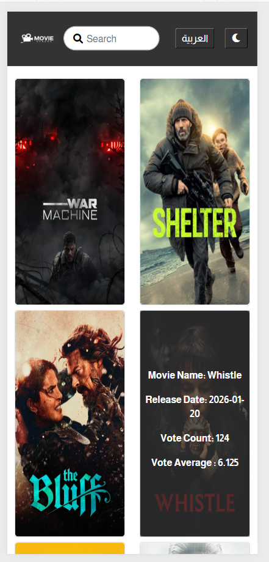

# 🎬 MovieSphere

**MovieSphere** is a modern **React.js** web application that allows users to explore and discover popular movies. The app fetches movie data from **The Movie Database (TMDb) API** and presents it in a **clean, responsive, and interactive interface**.

With Redux for state management, MovieSphere efficiently handles **movies, pagination, language, and theme preferences**, providing a seamless user experience.

---

## 🔗 Live Demo

[View MovieSphere Live](https://youssefadel170.github.io/moviesphere/)

---

## ✨ Features

- **Browse Popular Movies**: Explore trending movies fetched from TMDb.
- **Movie Search**: Search movies by title with instant results.
- **Pagination**: Navigate through multiple pages of movie results easily.
- **Multi-language Support**: Switch between **Arabic** and **English** for both UI and content.
- **Movie Details**: Detailed information including title, overview, rating, genres, and images.
- **Dark Mode Support**: Toggle between **light and dark themes**.
- **Responsive Design**: Optimized for **desktop, tablet, and mobile**.
- **State Management with Redux**: Efficient global state handling for movies, language, pagination, and theme preferences.

### Additional Planned Features

- Favorite movies list
- User authentication (login/signup)
- Movie trailers display
- Movie recommendations based on user activity

---

## 🛠 Tech Stack

- **Frontend**: React.js
- **State Management**: Redux
- **Styling**: React Bootstrap, Custom CSS
- **API**: TMDb API

---

## 🖼 Screenshots

### 💻 Desktop View (English & Light Mode)


### 💻 Desktop View (Arabic & Dark Mode)


### 🔍 Search Functionality


### 🌐 URL & Pagination Changes


### 📱 Mobile View (English & Dark Mode)



---

## 🚀 Getting Started

### Prerequisites

- **Node.js** (Download from [nodejs.org](https://nodejs.org))
- **npm** (Comes with Node.js installation)

### Setup Instructions

1. **Clone the repository**

```bash
git clone https://github.com/YoussefAdel170/moviesphere.git
```

2. **Navigate into the project directory**
   ```bash
   cd moviesphere
   ```
3. **Install dependencies**

   ```bash
   npm install
   ```

4. **Set up TMDb API Key**
   - Go to TMDb API and sign up if you don't have an account.
   - Generate an API key
   - Create a .env file in the root of your project and add the following line:
     REACT_APP_TMDB_API_KEY=your-api-key-here

5. **Run the application**

   ```bash
   npm start
   ```

6. **Open The Browser**

- Visit http://localhost:3000 in your browser to see the app in action.

## How It Works

1. **Fetching Movie Data**: The app fetches movie data using the TMDb API based on the selected language and page number.
2. **Pagination**: The app handles pagination, allowing users to navigate through multiple pages of movie results.
3. **Search Functionality**: Users can search for specific movies by title, and the app fetches and displays the results accordingly.
4. **Language Toggle**: The app supports toggling between Arabic and English, updating both the UI and the content based on the selected language.
5. **Theme Toggle**: Switch between dark and light modes for a customized viewing experience. This can be achieved using a button that toggles a dark-mode class or a React context to manage the theme state.
6. **Responsive Design**: The app is built to be fully responsive, making it easy to use on mobile, tablet, and desktop devices.
7. **Redux**: The app is now enhanced with Redux for better state management, including handling the dark mode, language, and movie data more efficiently.
